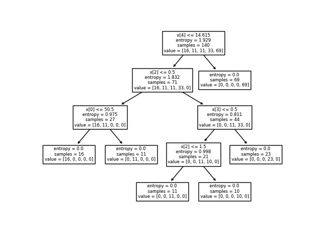

# 💊 Predicting Patient Medication Response using Decision Trees

A decision tree is a classification algorithm that uses a tree-like structure to represent a series of decisions and their possible consequences. Each node in the tree represents a decision point, and each branch represents a possible outcome of that decision. Decision trees are often used in non-linear decision making to create a simple linear decision surface.
<br>

To classify a new example using a decision tree, we start at the root of the tree and follow the branches down to a leaf node. Each internal node in the tree represents a decision about a specific attribute of the example, and each branch represents one of the possible values that the attribute can take. This process is recursive in nature and repeated until we reach a leaf node, which provides the classification for the example.
<br>

This project uses a decision tree to predict which medication is most likely to be effective for a new patient based on the historical response data. A trained decision tree is used to predict the medication that is most likely to be effective based on the patient's features.
<br>
<br>


## 📝 Dataset Description

Data has been collected on a set of 200 patients, all of whom suffered from the same illness. During their course of treatment, each patient responded to one of 5 medications: Drug A, Drug B, Drug C, Drug X, Drug Y.

The features of this dataset include:
- Age
- Sex
- Blood Pressure
- Cholesterol
- Drug (target - one of the 5 medications)

The dataset was obtained from [IBM Watson Studio](https://dataplatform.cloud.ibm.com/).
<br>
<br>

## ⚙️ Dependencies
- Python 3.x
- Numpy
- Pandas
- Scikit-learn
- Matplotlib
<br>
<br>

## ⬇️ Installation
To install this project, clone the repository and navigate to the project directory:
```shell
$ git clone https://github.com/NickMezacapa/Predicting-Patient-Medication-Response-using-Decision-Trees.git
$ cd Predicting-Patient-Medication-Response-using-Decision-Trees
```
<br>
<br>

## 🏃‍♂️ Usage
Execute the following command:
```shell
$ python main.py
```
<br>

This will train the decision tree model on the patient data and output the accuracy of the model. The decision tree will also be visualized.
<br>
<br>

## 📊 Results
The decision tree model was trained on 70% of the data and tested on the remaining 30%. The model achieved an accuracy of 0.9833 on the test set, meaining that it correctly predicted the most effective medication for 98.33% of the patients in the test set. The decision tree visualization shows the decision making process of the model, with each node representing a decision based on a patient attribute, and the edges representing the possible outcomes of that decision.<br>
<br>

The decision tree visualization is shown below:<br>
<br>
<br>

<p>
    
</p>


